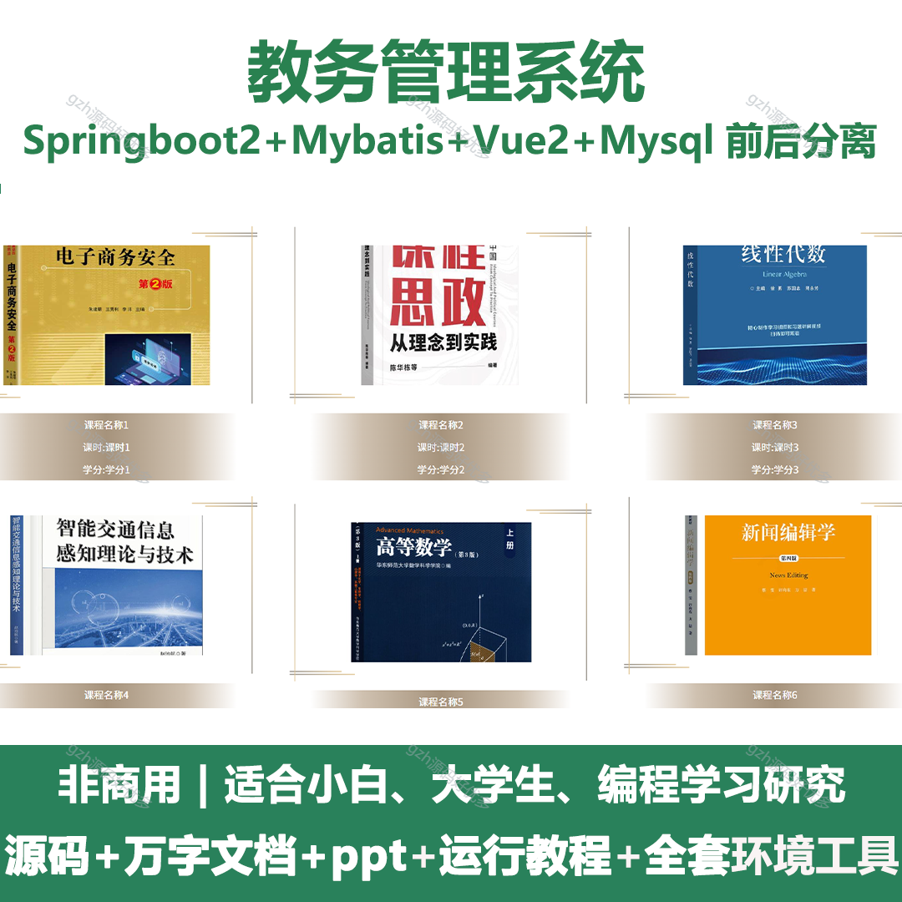
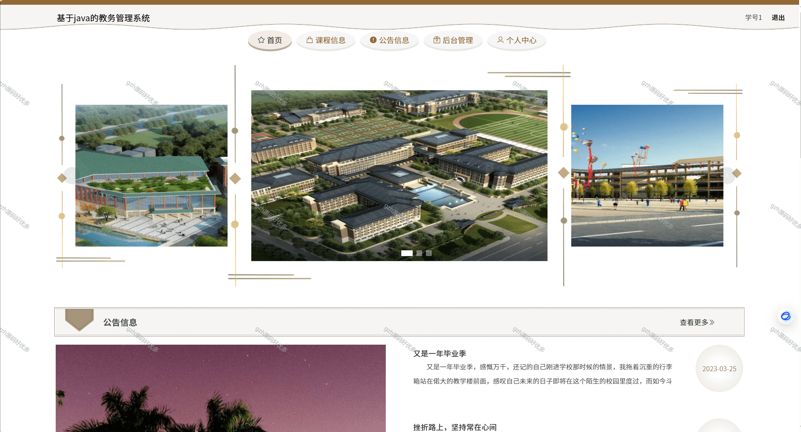
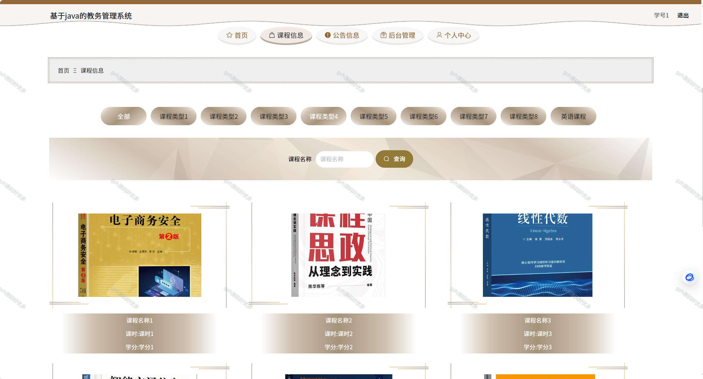
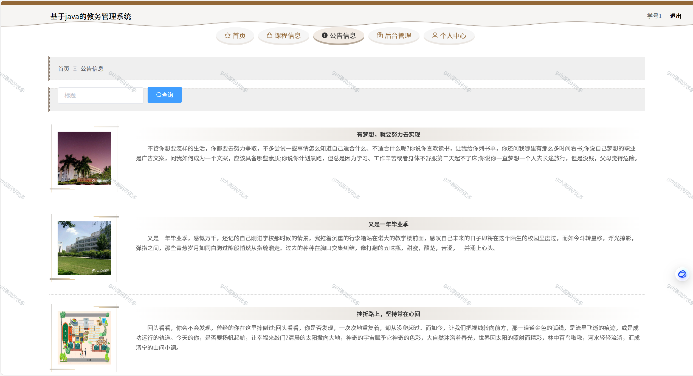
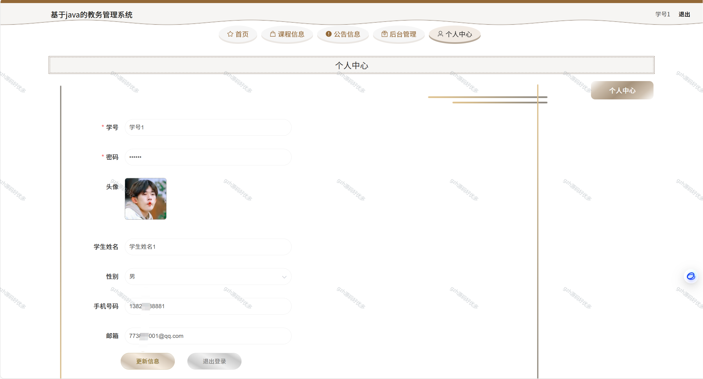
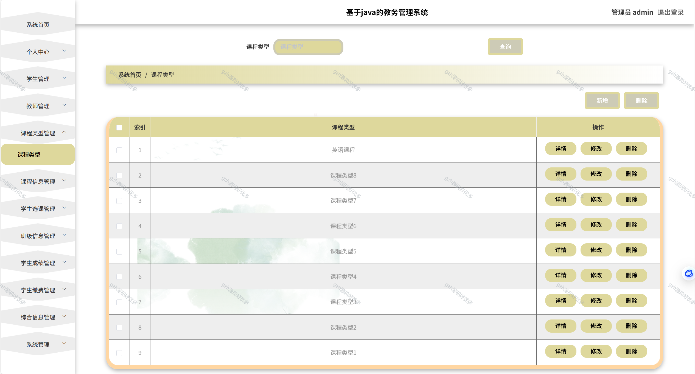
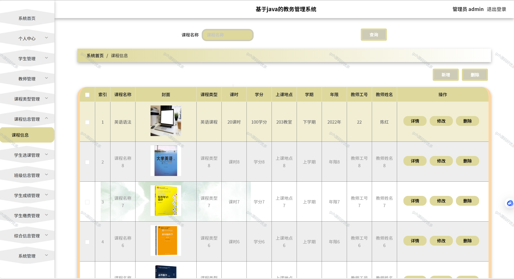
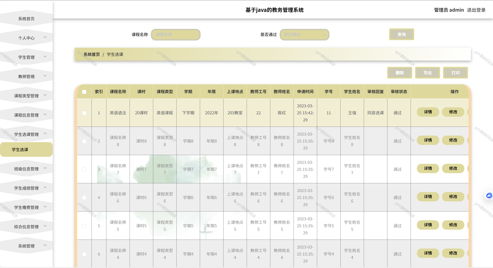
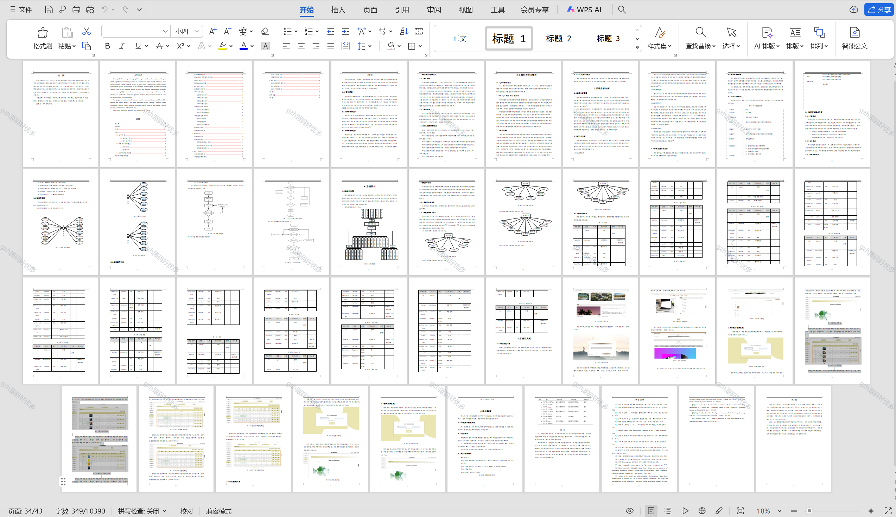

# springbootA264
springbootA264教务管理系统
 
## 查看主页获取源码

### 一、关键词
教学管理系统，教务信息系统，教学事务管理系统

### 二、作品包含
源码+数据库+设计文档万字+全套环境和工具资源+本地部署教程

### 三、项目技术
前端技术：Html、Css、Js、Vue2.0、Element-ui 
后端技术：Java、SpringBoot2.0、MyBatis

### 四、运行环境（以下版本亲测，其他版本兼容性请自行测试）
开发工具：IDEA/eclipse  + VSCODE

数据库：MySQL5.7（最低要5.7版本）

数据库管理工具：Navicat10以上版本

环境配置软件： JDK1.8 + Maven3.6.3

前端Nodejs：14

浏览器：谷歌浏览器

### 五、项目介绍
项目编号：springbootA264

快速发展的社会中，人们的生活水平都在提高，生活节奏也在逐渐加快。为了节省时间和提高工作效率，越来越多的人选择利用互联网进行线上打理各种事务，然后线上管理系统也就相继涌现。与此同时，人们开始接受方便的生活方式。他们不仅希望页面简单大方，还希望操作方便，可以快速锁定他们需要的线上管理方式。基于这种情况，我们需要这样一个界面简单大方、功能齐全的系统来解决用户问题，满足用户需求。
课题主要分为三大模块：即管理员模块和学生、教师模块，主要功能包括：学生、教师、课程信息、学生选课、班级信息、学生成绩、学生缴费、综合信息等；

### 六、运行截图

